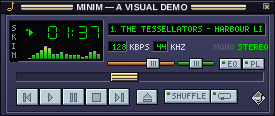
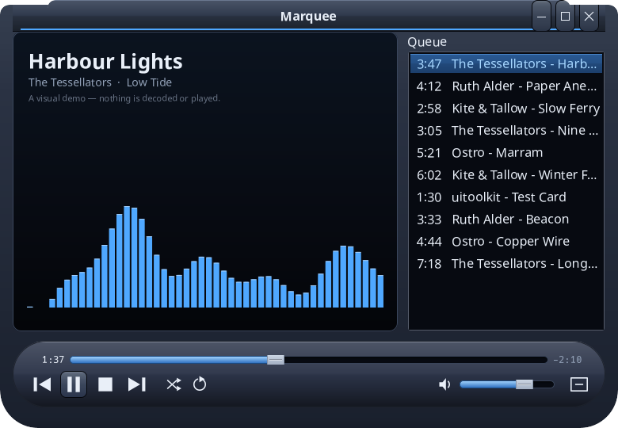
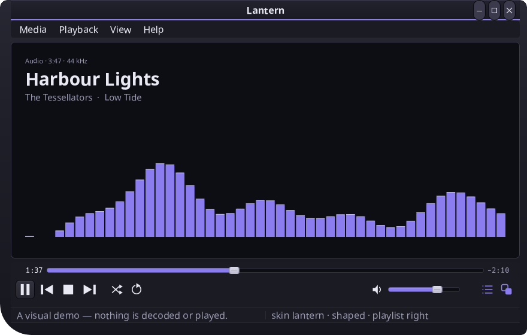

# media-player-music

A music player's **interface**, with three faces over one player — and it
plays nothing at all.



| | |
|---|---|
|  |  |
| **Marquee** — the cabinet | **Lantern** — the shaped window |

*(Every picture above is the application's own `-shot`, posed at 1:37.)*

It is a demonstration of what a desktop UI toolkit can be asked to do: skins
that are whole pictures of a window with holes where the controls go,
windows cut to an outline that is not a rectangle, windows that snap to each
other's edges and travel together, and a look that can be changed live under
a running application without rebuilding a single control. All of it is
built on [uitoolkit](https://github.com/codemodify/uitoolkit), and nothing
here reaches inside it: every line of this repository is written against
uitoolkit's public API, which is half the point of it existing.

## It plays nothing

**Nothing here is decoded and nothing is played.** There is no audio stack,
no video stack and no media dependency of any kind — not in this repository
and not in the toolkit under it.

What there is instead is a clock that counts, a list of ten invented tracks,
a band of numbers that move the way a spectrum analyser does, and an
equaliser whose ten faders filter nothing. The seek bar scrubs the clock.
The analyser is a function of where the clock is. Every face says so where
it cannot be missed — in a title bar, on a display, in a status line, in an
About box, and in every menu row that would need a media stack if you picked
it.

That is deliberate and it is not going to change. The subject here is the
*interface*: adding PipeWire, ALSA or FFmpeg to make the demo honest would
make it a different project. Every title, artist and album in the library
was made up for this repository, and no art, bitmap, icon, font, name or
mark belonging to any real player is in it.

## The three faces

A face is a way of showing the player. They share no interface at all —
that is the point of having three — and they share everything underneath:
the transport, the queue, the equaliser and the analyser belong to the
application and are handed to whichever face is being worn.

So **changing face does not restart the player**. The old face's windows
close, the new one's open around the same model, and the track goes on from
exactly where it was, in the same queue, at the same volume, with the same
curve on the equaliser.

| | **Minim** | **Marquee** | **Lantern** |
| --- | --- | --- | --- |
| what it is | a strip, 275 × 116 design pixels | a cabinet, 780 × 540, that folds to 468 × 104 | a window with a menu bar, 880 × 560 |
| windows | three, stacked and travelling together | one, in two shapes | two, one anchored to the other |
| skins | `minim`, and two panels it switches between live: `minim-classic` and `minim-silver` | `marquee` | `lantern` |
| what it demonstrates | proportions as design pixels, pixel art at fractional scales, windows that snap, one widget tree laid out as three different panels | one control changing the size, the layout **and** the window's outline at once | a skin is an ordinary theme pack: one key drops it and the app is unchanged |

- **Minim** is the compact one. An equaliser and a playlist snap flush to
  the strip's edges and travel with it. Two of its three skins are *panels*
  — a picture of the whole window with holes where the keys are — and the
  player carries no coordinates of its own for either: it binds its controls
  to named slots and asks the skin it is wearing where each one is.
- **Marquee** is the big one. Ctrl+M, or the key at the end of its curved
  shelf, folds it into a flat stadium and back. It is the one place in the
  application where an *app* sets a window silhouette of its own; everywhere
  else the outline belongs to the skin.
- **Lantern** is the shaped one. Its window is cut to its skin's outline,
  its playlist is anchored to its right-hand edge, and one control drops the
  skin and runs the same widget tree in an ordinary theme — the same tab
  order, the same accessibility tree, the same keyboard, and a window that
  is a rectangle again.

The skins live in uitoolkit, embedded and registered as ordinary theme
packs. This repository carries no art: wearing one is a pack switch, the
same call the toolkit's own Settings makes for any theme.

## Build and run

```bash
go build ./...
go run .                          # the face and skin last used
go run . -face minim              # the compact strip
go run . -face marquee            # the cabinet that folds
go run . -face lantern            # the shaped window
go run . -skin minim-classic      # in one of that face's skins
go run . -skin breeze-night       # with the skin dropped, in an ordinary theme
go run . -only strip              # the compact face's strip on its own
go run . -compact                 # the cabinet, folded down
go run . -scale 1.75              # at a fractional scale
go run . -shot out/               # paint one posed frame of each window and exit
```

The face and the skin are remembered between runs, per face, in
`$XDG_CONFIG_HOME/uitoolkit/media-player-music.json`. A `-shot` run is posed
rather than used, so it neither reads nor writes that.

### The keyboard

```
Space   play / pause        ←  →   seek five seconds
Z  B    previous / next     ↑  ↓   volume
V       stop                M      mute
S       shuffle             R      repeat: off → all → one
Ctrl+F  next face           Ctrl+Shift+F   the face before
Ctrl+K  next skin           Ctrl+Shift+K   drop the skin, and put it back
Escape  quit                Ctrl+Q         quit
```

Minim adds the menu key (Shift+F10) for its skin menu, Marquee adds Ctrl+M
to fold, and Lantern adds Ctrl+L for its playlist. Choosing a face by name
is in a menu each face offers where it has room for one: Minim's playlist
keys, a right-click on Marquee's cabinet, Lantern's View menu.

### Tests

Every test opens real windows, headless, so none of them may be run against
the desktop they run on:

```bash
tools/testenv.sh go test ./...
```

`tools/testenv.sh` runs a command with no Wayland or X11 display, a private
D-Bus session bus that can start no services, and XDG directories of its
own.

## What it is built on

[uitoolkit](https://github.com/codemodify/uitoolkit) — a Go desktop UI
toolkit with its own painting, its own widgets, Wayland and X11 backends, an
accessibility tree, and themes and skins as packs. This application uses its
public API and nothing else; `go list -deps ./... | grep uitoolkit | grep
internal` is empty, and is meant to stay that way.

Worth knowing, if you are reading this for the toolkit rather than for the
player: every control here is an ordinary component. The transport keys are
`widgets.ToolButton` with a mark painted on them; the faders are
`widgets.Slider` stood on end; the skinned ones are the same widgets with a
painter that draws the skin's art instead of the look's face. They take the
focus, answer Return and Space, name themselves in the accessibility tree
and keep their focus ring whatever picture is painted under it.

## Documentation

[docs/faces.md](docs/faces.md) — the three faces in detail, the skins and
their layouts, what a desktop may refuse, how the pieces fit together, and
what is tested.

## Licence

The Free License — see [LICENSE](LICENSE).
